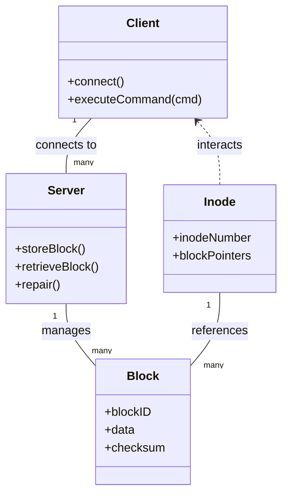

# Network File System

A distributed network file system with Linux-like inode and block arrangement, RAID5-style parity distribution, data integrity through hashing, and fault tolerance with automated recovery.


---

## Features

- **Distributed Storage:** Data and parity blocks are distributed across multiple servers (RAID5 style).
- **Linux-like Filesystem Structure:** Inode and block-based file management.
- **Data Integrity:** Hashing for block-level integrity checks.
- **Fault Tolerance:** Parity allows recovery from single server failures.
- **Automated Recovery:** Failed servers can be rebuilt from parity data.
- **Extensible CLI:** Supports common file operations and advanced block management.

---

## High-Level Architecture


### Parity Distribution Block Diagram


## UML Overview



---

## Running Instructions

### Prerequisites

- Python 3.x
- Install dependencies:
  ```bash
  pip install -r requirements.txt
  ```

### Starting Servers

Start each server instance (use unique ports):

```bash
python3 server.py -nb 256 -bs 128 -port <server_port>
```
*(Repeat for each server—at least 4 recommended for RAID5 demonstration)*

### Starting Clients

In a new terminal, after servers are running:

```bash
python3 client.py -port 8000 -cid 0 -startport <first_server_port> -ns <num_servers> -nb <total_data_blocks>
```

### Using the CLI

Commands include:

- Basic: `cd`, `ls`, `mkdir`, `create`, `rm`, `cat`, `exit`
- Advanced: `lnh`, `lns`, `append`, `slice`, `mirror`, `showblock`, `showinode`, `repair`, `load`, `save`

### Recovery

To recover a failed server, restart it and run:
```bash
# Use the repair command in the client CLI
repair
```

---

## References

- [Project Report](https://github.com/nitingoyal0996/network-file-system/blob/main/Report.pdf)
- Credits: https://mohitdtumce.medium.com/network-file-system-nfs-d0c08e191ab2

---

**Note:** For best results, ensure all servers and clients are started as described, and refer to the CLI help for command details.
