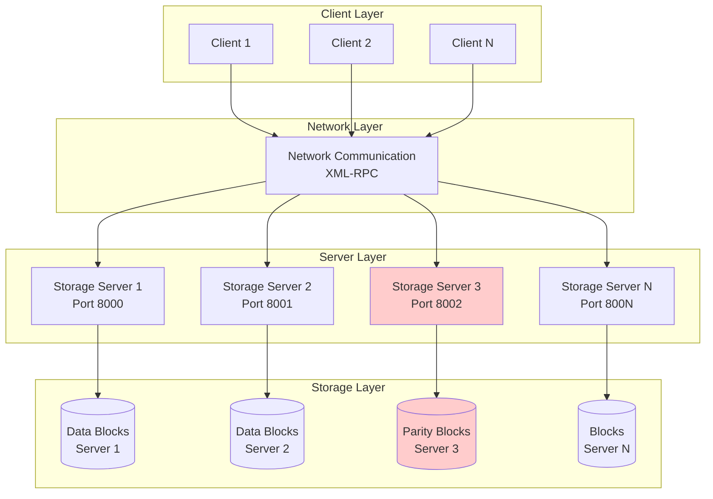

# Network File System

## Project Overview

A distributed file system implementation in Python that leverages **RAID5 architecture** for efficient storage utilization, load balancing, and robust fault tolerance. The system provides recovery capabilities from single block failures or entire server outages through distributed parity blocks and MD5 checksums for data integrity.

<div align="center">
    
    <p><em>Figure 1: Generic Network File System Block Diagram</em></p>
</div>

This academic implementation demonstrates core distributed systems concepts including data striping, parity distribution, fault detection and recovery, and client-server architecture in networked storage systems.

## Features

- **RAID5 Distributed Storage**: Efficient data striping with distributed parity blocks across multiple servers
- **Fault Tolerance**: Automatic recovery from single block or entire server failures
- **Data Integrity**: MD5 checksum validation for detecting and correcting data corruption
- **Load Balancing**: Distributed read/write operations across multiple storage servers
- **Multi-Client Support**: Concurrent access from multiple clients with shared file operations
- **Scalable Architecture**: Support for up to 8 storage servers with configurable block sizes
- **Linux-like Interface**: Familiar command-line interface with standard file system operations
- **Advanced Operations**: Support for hard links, soft links, file slicing, and mirroring
- **Recovery Tools**: Built-in repair mechanisms for data recovery and consistency checks
- **Academic Testing**: Comprehensive test suite with Docker-based automated validation

## High-Level Architecture

The system implements a distributed RAID5 architecture where data and parity blocks are distributed across multiple storage servers to ensure fault tolerance and load balancing.

<div align="center">
    
    <p><em>Figure 2: RAID5 Parity Distribution Block Diagram</em></p>
</div>

### Architecture Components



### Key Architectural Features

- **Distributed Data Placement**: Files are split into blocks and distributed across servers
- **Parity Calculation**: XOR-based parity blocks enable single-server failure recovery
- **Client-Server Communication**: XML-RPC protocol for remote procedure calls
- **Block-Level Operations**: Configurable block sizes (default: 128 bytes, 256 blocks)
- **Concurrent Access Control**: Locking mechanisms for multi-client environments

## UML Overview

The system architecture follows object-oriented design principles with clear separation of concerns across different layers.

```mermaid
classDiagram
    class DiskBlocks {
        +block: List[bytearray]
        +checksum: Dict
        +Get(block_number): bytearray
        +Put(block_number, data): bool
        +CalculateParity(blocks): bytearray
        +RecoverDataBlock(location, block_number): bytearray
        +RecoverParityBlock(block_idx): bytearray
    }
    
    class FileOperations {
        +Create(filename): int
        +Open(filename): int
        +Read(inode_number, offset, count): bytearray
        +Write(inode_number, offset, data): int
        +Link(target, linkname): int
        +Unlink(filename): int
    }
    
    class FSShell {
        +Interpreter(): void
        +cd(pathname): void
        +ls(pathname): void
        +cat(filename): void
        +create(filename): void
        +mkdir(dirname): void
        +rm(filename): void
        +repair(block_number): void
    }
    
    class InodeNumber {
        +inode_number: int
        +inode: Inode
        +InodeNumberToInode(RawBlocks): void
        +StoreInode(RawBlocks): void
    }
    
    class Inode {
        +size: int
        +type: int
        +refcnt: int
        +block_numbers: List[int]
        +InodeFromBytearray(data): void
        +InodeToBytearray(): bytearray
    }
    
    class FileName {
        +RawBlocks: DiskBlocks
        +FindPath(path): Tuple
        +Create(parent_inode, filename, type): int
        +Lookup(parent_inode, filename): int
    }
    
    FSShell --> FileOperations
    FSShell --> DiskBlocks
    FileOperations --> FileName
    FileOperations --> InodeNumber
    InodeNumber --> Inode
    FileName --> DiskBlocks
    DiskBlocks --> "Network Servers"
    
    note for DiskBlocks "Handles RAID5 operations\nand network communication"
    note for FileOperations "Manages file system\noperations and metadata"
    note for FSShell "Interactive command-line\ninterface for users"
```

## Running Instructions

### Prerequisites

- Python 3.x
- Network connectivity between client and server machines
- Sufficient disk space for block storage

### Server Setup

1. **Clone the repository**:
   ```bash
   git clone https://github.com/nitingoyal0996/network-file-system.git
   cd network-file-system
   ```

2. **Start storage servers** (run each in a separate terminal):
   ```bash
   # Server 1
   python3 src/server.py -nb 256 -bs 128 -port 8000
   
   # Server 2  
   python3 src/server.py -nb 256 -bs 128 -port 8001
   
   # Server 3
   python3 src/server.py -nb 256 -bs 128 -port 8002
   
   # Server 4
   python3 src/server.py -nb 256 -bs 128 -port 8003
   ```

   **Parameters**:
   - `-nb`: Total number of blocks (256)
   - `-bs`: Block size in bytes (128)
   - `-port`: Server port number (must be consecutive)

### Client Setup

3. **Start file system client**:
   ```bash
   python3 src/client.py -port 8000 -cid 0 -startport 8000 -ns 4 -nb 1024
   ```

   **Parameters**:
   - `-port`: Client connection port
   - `-cid`: Client ID (unique identifier)
   - `-startport`: First server port
   - `-ns`: Number of servers (4)
   - `-nb`: Total data blocks

### Available Commands

Once the client CLI is active, you can use these commands:

**Basic File Operations**:
- `ls [path]` - List directory contents
- `cd <path>` - Change directory
- `mkdir <dirname>` - Create directory
- `create <filename>` - Create empty file
- `cat <filename>` - Display file contents
- `rm <filename>` - Remove file

**Advanced Operations**:
- `append <filename> <data>` - Append data to file
- `slice <filename> <start> <end>` - Extract file slice
- `lnh <target> <linkname>` - Create hard link
- `lns <target> <linkname>` - Create soft link
- `mirror <filename>` - Create file mirror

**System Operations**:
- `load <filename>` - Bulk load data
- `save <filename>` - Save file system state
- `repair <block_number>` - Recover corrupted block
- `showblock <block_number>` - Display block contents
- `showinode <inode_number>` - Display inode information
- `showfsconfig` - Show file system configuration

### Testing and Validation

**Docker Testing Environment**:
```bash
# Run automated tests
docker run -it --rm --name pocsd --mount type=bind,source="$(pwd)",target=/tmp rjofig/pocsdgrading 3
```

**Manual Recovery Testing**:
1. Stop one server to simulate failure
2. Perform file operations from client
3. Restart server and run `repair` command
4. Verify data integrity with checksums

## References and Credits

- **Project Report**: [Detailed technical documentation](https://github.com/nitingoyal0996/network-file-system/blob/main/Report.pdf)
- **Architecture Reference**: [Network File System (NFS) Overview](https://mohitdtumce.medium.com/network-file-system-nfs-d0c08e191ab2)
- **RAID5 Implementation**: Based on academic distributed systems principles
- **Testing Framework**: Docker-based automated testing environment
- **Protocol**: XML-RPC for client-server communication

### Academic Context

This implementation serves as an educational tool for understanding:
- Distributed storage systems design
- RAID5 parity calculations and recovery algorithms  
- Fault tolerance mechanisms in networked systems
- Client-server architecture patterns
- File system metadata management
- Network protocol design for storage systems

**Course Integration**: Suitable for distributed systems, operating systems, and computer networks courses at the undergraduate and graduate levels.
