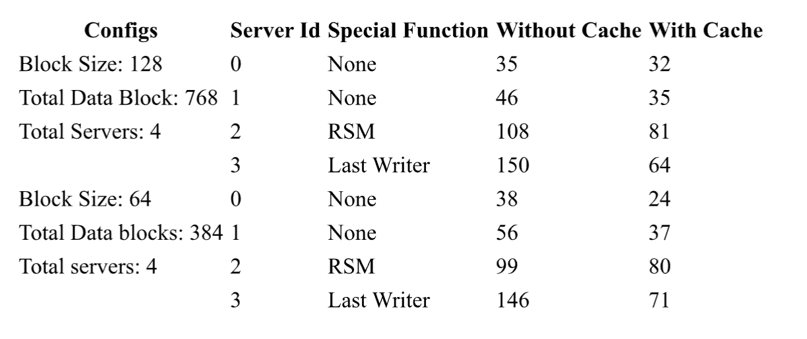

# Distributed File System

In this project implements a distributed file system in `python`. Application utilize <u>RAID5</u> architecture to enable efficient use of storage, load balancing and robust fault tolerance/recovery from single block or entire server failure using distributed parity blocks across servers and `md5` checksum.

<div style="display: flex; justify-content: center; gap: 20px;">
    <div align="center" style="max-width: 30%;">
        
        <p>RAID5 Parity Distribution</p>
    </div>
    <div align="center" style="max-width: 30%;">
        
        <p>Server Failure</p>
    </div>
</div>

More details about design of RAID5, server fail over, checksums and recovery procedures are provided in the `Report.pdf`.

## Table of Contents

- [Distributed File System](#distributed-file-system)
  - [Table of Contents](#table-of-contents)
  - [Design](#design)
  - [Installation](#installation)
    - [Prerequisites](#prerequisites)
    - [Steps](#steps)
  - [Usage](#usage)
    - [Storage Servers](#storage-servers)
    - [File System Clients](#file-system-clients)
    - [Working With Client CLI](#working-with-client-cli)
  - [Testing](#testing)
  - [Results](#results)
    - [Load distribution](#load-distribution)

## Design

            +-----------------------+
            |   File System Client  |
            +-----------|-----------+
                        |
                        | Network Communication
                        v
            +------------------------+
            |        Network         |
            +------------------------+
                        |
                        v
            +-----------------------+
            |        Servers        |
            +-----------------------+
            | +-------------------+ |
            | | Network Interface | |
            | +-------------------+ |
            | | RAID-5            | |
            | +-------------------+ |
            | | Block Storage     | |
            | +-------------------+ |
            | | Inode Management  | |
            | +-------------------+ |
            | | Checksum/Parity   | |
            | +-------------------+ |
            +-----------|-----------+
                        |
                        v
            +------------------------+
            |         Memory         |
            +------------------------+

## Installation

### Prerequisites

- Python 3.x
- Required packages (listed in `requirements.txt`)

### Steps

1. Clone the repository:

    ```bash
    git clone https://github.com/nitingoyal0996/distributed-file-system.git
    ```

2. Navigate to the project directory:

    ```bash
    cd distributed-file-system
    ```

3. Install the necessary dependencies:

    ```bash
    pip install -r requirements.txt
    ```

## Usage

### Storage Servers

To initiate servers (ensure that the server ports differ by at most 1):

1. Replace the start_port in the following command and run it.

    ```bash
    python3 ./server.py -nb 256 -bs 128 -port <start_port>
    ```

    This should start up a new file system server.

### File System Clients

To start the file system client -

1. Start a new terminal
2. Once all servers are operational, open up a new terminal and connect the clients using:

    ```bash
    python3 ./client.py -port 8000 -cid 0 -startport <start_port> -ns 4 -nb <total_data_blocks>
    ```

    Running this command should open up a new client CLI which lets you interact with the file system.

### Working With Client CLI

- Project contains a CLI (`shell.py`) to interact with the file system. CLI exposes multiple basic linux-like file system operations.

    `cd`, `cat`, `ls`, `mkdir`, `create`, `rm`, `exit`
- Along side more complex methods to create soft links and hard links.

    `lnh`, `lns`, `append`, `slice`, `mirror`

- CLI also exposes methods to debug and visualize the data available on block level
    `showblock`, `showinode`, `showblockslice`, `showfsconfig`, `showphysicalblock`

- You could also bulk load a set of data into the file system using `load` and `save` command.

- If server is failed and comes back online, you could recover the data on that server using `repair` command.

You can spin up a cluster of servers (up to 8) and can add potentially as many clients to connect with the servers as needed.

Each of the client could perform CRUD operations on shared files.

## Testing

The majority of the logic was graded with automated tests - using github workflow.

## Results

### Load distribution 

<div align="center" style="max-width: 30%;">
    
    <p>Load Distribuion</p>
</div>
