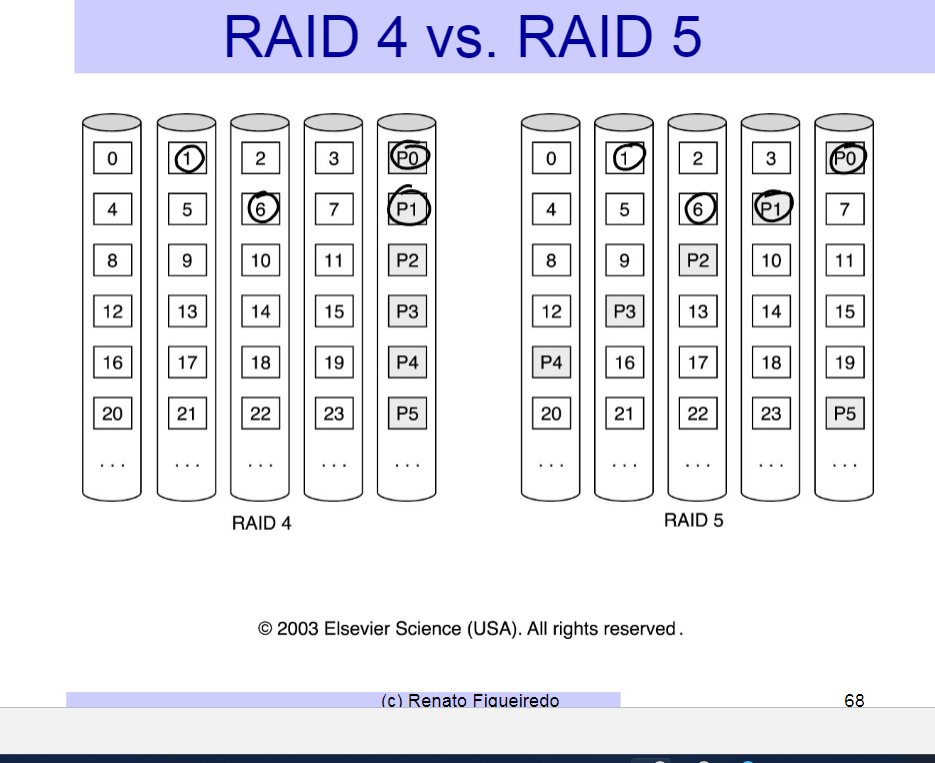
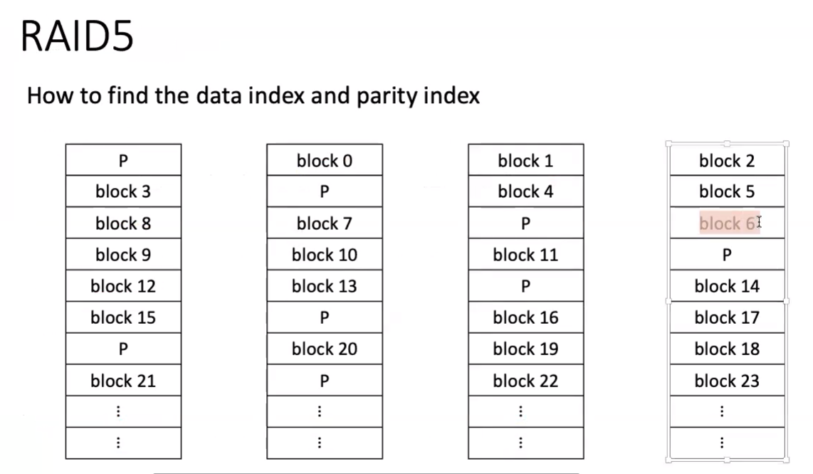

# HW#5 #

Running the project:

Server: `python3 ./blockserver.py -nb 256 -bs 128 -port 8000`

client: `python3 ./fsmain.py -port 8000 -cid 0 -startport 8000 -ns 4`

Total number of blocks = `-nb = (number_of_servers - 1) * (number_of_block_size_each_server)`

## Concept Reference: Chapter 8: Lecture 24-26 ##

Strategy is to start from basic RAID-0 and then go up to RAID-5, thus gradually increasing complexity.

### Brief ###

#### RAID-0 [DONE] ####

- Multiple server, - round robin on the blocks
- Just distributed storage
- No redundancy - system faces failures if a server dies
- no fault tolerance - simplest, fastest

```python
# for round robin on servers - 

def __init__(...): 
  # ...
  # 1. last server used
  self.last_block_server_idx = 0
  # 2. keep track of the blocks and the server mapping - 
  self.block_server_map = {}
  # ...

# 3. Add logic to select block_server on reads and writes
def Put(...):
  # ...
  if block_number not in self.block_server_map:
      self.block_server = self.block_servers[self.last_block_server_idx]
      self.block_server_map[block_number] = self.block_server
      self.last_block_server_idx = (self.last_block_server_idx + 1) % fsconfig.MAX_SERVERS
      ret = self.block_server.Put(block_number, putdata)
  else:
      ret = self.block_server_map[block_number].Put(block_number, putdata)
  # ...

# Similarly, for Get() method
```

#### RAID-1 [Done] ####

- N disks replication - Mirroring i.e. each block write will go to every server
- Redundancy - system continues to work even with single/multiple server failures.
- No fault tolerance

```python

def __init__(): 
  # ...
  # define array for xmlrpc block server objects
  self.block_servers = []
  for i in range(0, fsconfig.MAX_SERVERS):
      self.block_servers.append(xmlrpc.client.ServerProxy(self.server_addresses[i], use_builtin_types=True))
  # fix the rsm block server
  self.rsm_block_server = self.block_servers[fsconfig.MAX_SERVERS-1]
  # ...

def Put(...):
  # ...
  for i in range(0, fsconfig.MAX_SERVERS):
      ret = self.block_servers[i].Put(block_number, putdata)
  # ...

def Get(...):
  # ...
  for i in range(0, fsconfig.MAX_SERVERS):
    data = self.block_servers[i].Get(block_number)
    if data != -1:
        break
  # ...

```

#### RAID-4 ####

- N replicated data disks - Block InterLeaving: RAID 0
- Block level parity


- Dedicated parity disks
- Checksum
- No need to sleep before retrying
- On failure - print `Server_Disconnected` message

#### RAID-5 ####

RAID-4 + Distributed Parity Store




## Error detection ##

Q. How do we messages and error correction codes and decoding them so that we could detect the error?

### Simple Parity ###

Instead of sending just byte, we need additional information - we check the pattern - parity - and validate it. _If exactly one bit flips - there is an error._

```python
# Hamming Code 2
parity = XOR(data)
XOR(data, parity) = 0
```

How do you tell which bit has an error? - you take xor and pass the bits through it to detect even/odd - to identify the errornous bit we need more redundancy.

### ECC - Error Correction Codes ###

- Hamming Distance - ECC
- forward error correction - when module is far away, long time/latency
- backward error correction - request from source, retry

```python
# Hamming Code 3
# data = 4 bits (P7, P6, P5, P3): I want to recieve
# say ECC = 3 bits (P4, P2, P1): generated through the data

# total 8 combination where error could occur
# Log(8) => 3 bits for ECC

# XOR for every other bit - SKIPPING 2^0
P1 = XOR(P7, P5, P3) 
# - SKIPPING 2^1 = 2 BITS
P2 = XOR(P7, P6, P3)
# - SKIPPING 2^2 = 4 BITS
P4 = XOR(P7, P6, P5)

# MESSAGE
DATA = [P7|P6|P5|P3|P4|P2|P1]

# when we generated the message the below condition were true

XOR(P7, P5, P3, P1) = 0 
XOR(P7, P6, P3, P2) = 0
XOR(P7, P6, P5, P4) = 0
```

if error - one or more equations will return 1 \
if no error - all of these will return 0

```yaml
In above situation -

1. Error in P7 - P4, P2, P1 don't hold - error in bit - 4+2+1
2. Error in P6 - P4, P2 don't hold - error in bit - 4+2
3. Error in P5 - P4, P1 don't hold
4. Error in P4 - P4 don't hold
5. Error in P3 - P2, P1 don't hold
6. Error in P2 - P2 don't hold
7. Error in P1 - P1 don't hold
```

## Code to deal with erasures ##

If one of the items has failed and we have information its identity - parity is sufficient.

```python

  # Break 4-block Put(key, blk) into:
  Put(key_1, blk1), Put(key_2, blk2), Put(key_3, blk3), Put(key_4, blk4),
  # Compute parity for one bit at a time from each of the data block
  Put(key_p,(XOR(blk1, blk2, blk3, blk4)))

  # Handle 4-block blk = Get(key) as:
  Get(key_1), Get(key_2), Get(key_3), Get(key_4)
  # Suppose server for key_3 does not reply:
  blkp = Get(key_p)
  # Regenerate the block-3 data
  blk = XOR(blk1, blk2, blk4, blkp)

```

### Checksum ###

```yaml
  - checksum per block
  - tell us about where an error has happend 
  - we discard the block with error
  - then, using parity we regenerate the block
```

## Replication ##

1. if one module fail, we could detect and mask the error
2. if two modules fail, we could fail-fast

We have multiple replications of a system and _all replicated systems perform all of the functions_.

Replicated modules could vote over the state of the system/data and majority wins i.e. if two out of three messages say that there is an error - we initiate process to replace the module.

--------------------------

## Running the project - Useful Commands ##

## Requirements ##

### System ###

1. Support for N servers (at-least N=4)
2. _Distribute data and parity_ information across servers
3. Store block checksum (128-bit MD5) information to detect single-block errors - corrupt blocks.
4. Store checksums in a dedicated data structure in the server.

### For Reads ###

1. Distribute requests across servers holding data for different blocks
2. For a large file of B blocks, have on average B/N requests handled by each server.
3. _Data Integrity_ detection should first utilize checksums and then parity server.
4. _Data correction_: Incase of error in a single block server/block, the other server's block and parity should correct the error

### For Writes ###

1. Updates both data and parity block - compute the new parity from old data, old parity and new data.
2. If both writes - data and parity - are successful - write is successful and client returns
3. If one did acknowledge - system should register ther server that did not respond and continue future operations with remaining blocks - non-faulty servers.
4. Tolerate fail-stop failure of a single server.
5. If a server has failed, you won't be able to write new blocks to it - but writes can still complete successfully by using the remaining disks. -  recall how RAID-5 uses XOR of the old data, new data and parity block to generate a new parity block.

### For Repair ###

Must implement simple process of repairing/recovery.

1. When a server is crashed is replaced by a new server with blank blocks.
2. Repair procedure:
   1. command `repair server_id`
   2. client locks access to the disk
   3. reconnects to `server_id`
   4. regenerates all blocks for `server_id` using data from other servers in the array.

## Changes Required ##

### `block.py` ###

- Implement logic to handle N servers - based on `-ns` parameter - we will have an array of port numbers where the servers are.
- Implement logic to distribute blocks across multiple servers - Put() and Get() => RAID-5 approach.
- Implementation for failure handling -

  - __Corrupt Block__: Get() returns an error
  - __Fail-stop__: server is down and does not respond to Get() or Put()

- Implement messaging
  
    ```python
    CORRUPTED_BLOCK block_number
    SERVER_DISCONNECTED operation block_number
    # Examples:
    CORRUPTED_BLOCK 100
    SERVER_DISCONNECTED PUT 3
    ```

- Implement repair
- update RSM()

### `shell.py` ###

`-startport`: starting port for the first server

`-ns`: number of servers

`-logcache`: enables logging of cache messages

### `blockserver.py` ###

- allocate datastructure to store checksum information
- store checksum on Put()
- verify checksum on Get() and RSM()
- `-cblk`: block number that is emulalted as corrupted
-
