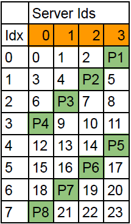
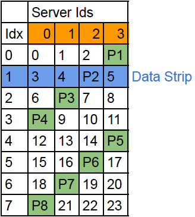
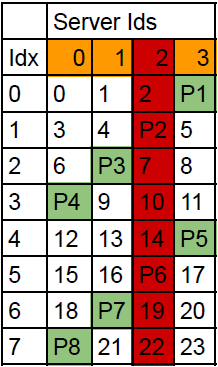

<div style="text-align: center;">
<h2>Course: EEL5737 </h2>
<h2> Project: Distributed and Fault Tolerant File System </h2>
<h3> Author: Nitin Goyal (UFID: 87003630) </h3>
</div>

</br>

## Table Of Content ##

- [Table Of Content](#table-of-content)
- [Introduction](#introduction)
- [Design and Implementation ](#design-and-implementation-)
  - [Load Distribution](#load-distribution)
  - [Fault Tolerance](#fault-tolerance)
    - [Parity](#parity)
    - [Checksum](#checksum)
  - [Recovery](#recovery)
    - [Block Recovery](#block-recovery)
    - [Server Recovery](#server-recovery)
    - [Failover](#failover)
- [Evaluation ](#evaluation-)
- [Reproducibility ](#reproducibility-)
  - [Running The Project](#running-the-project)
    - [Failover and Server Failure](#failover-and-server-failure)
    - [Corrupt block](#corrupt-block)
- [Conclusions ](#conclusions-)

## Introduction<a name="introduction"></a> ##

The project presents a comprehensive solution for distributed data management and fault tolerance within a server cluster environment. Leveraging RAID-5 methodology, it distributes data and parity across multiple servers, aiming to reduce server load and enhance fault tolerance. The system facilitates client awareness of data blocks while managing mapping between client block numbers and server addresses. This report outlines the project's functionalities, including block and server recovery strategies, failover handling, and corruption simulations.

## Design and Implementation <a name="design"></a> ##

### Load Distribution ###

There are two primary motivations for distributing data across multiple servers:

1. **Reduced Server Load**: Distribution helps in distributing incoming requests, lowering the load on individual servers.
2. **Increased Fault Tolerance**: It enhances the system's resilience against failures.

To achieve data distribution, the project utilizes the RAID-5 methodology. RAID 5 distributes both parity and data across available servers.

The client is aware of the data blocks. RAID 5 handles the mapping of client block numbers to server numbers and physical block numbers, managing the number of servers and request distribution.



The mapping mechanism employs `MapVirtualBlockToPhysicalAddress` and `MapPhysicalAddressToVirtualBlock` methods. For instance, given virtual block number `10`, the program maps it to server `2` and block index `3`, and vice versa, ensuring access to data blocks exclusively.

Both of the functions are designed to skip the parity blocks and make sure client only have access to data blocks.



A data strip encompasses blocks across servers for a given block index (as depicted in Figure 2), with each strip containing associated parity stored on one server.

The method `GetParityServer` determines the parity server for a specific block index. For instance, for block index `3`, the program identifies the parity server as `0`.

The mapping method includes a helper function, `GetBlockNumberOnStrip`, providing all blocks within a data strip. This is valuable for parity, block, and server recovery processes.

### Fault Tolerance ###

The project ensures tolerance for two types of failures, employing data recovery leveraging other data blocks and parity within the data strip:

1. **Server Failure**: The system aims to remain operational even after a complete server crash. Upon recovery, the client can retrieve data using other blocks and parity within that data strip.

2. **Corrupt Block**: If a block becomes corrupt, a checksum validates the data before returning it to the client. In case of corruption, the recovery method utilizes parity and other data blocks within the data strip.
  
#### Parity ####

The `GetParity` method manages parity calculation, addressing two scenarios:

1. **Initial Parity Creation**: When creating parity for the first time on a data strip, the method fetches all data blocks within the strip and calculates the parity.

2. **Updating Parity**: If some parity already exists on the strip and certain block data is updated, it recalculates the parity using the previously calculated parity and new data.

```python
# GetParity()
# ...
# ...
  # create parity with data on the strip - data blocks
  strip = self.GetBlockNumberAcrossServers(block_idx)
  blocks = strip[0]
  data = self.FetchDataBlocks(blocks)
  # calculate and return parity 
  new_parity = self.CalculateParity(data)
# ...
# ...
  # updating parity
  data = [old_data, new_data, old_parity]
  # calculate and return parity 
  new_parity = self.CalculateParity(data)
```

#### Checksum ####

When writing to a server block, the system calculates a checksum using hashlib.md5 and stores it in a dictionary.

```python
# PUT()
# ...
# ...
    block_checksum = hashlib.md5(data.data).hexdigest()
    # emulating corruption
    print('>>> Checksum Returned From PUT Server ', cblk, block_number)
    if block_number == cblk and RawBlocks.make_corrupt: 
       RawBlocks.make_corrupt = False
       block_checksum = block_checksum[:5] + '12345'
    RawBlocks.checksum[block_number] = block_checksum
# ...
# ...
```

Upon reading data, the system recalculates the checksum and compares it with the saved checksum. Any discrepancy flags an error `CHECKSUM_ERROR` on the client.

```python
# GET()
# ...
# ...
    has_error = False
    result = RawBlocks.block[block_number]
    current_checksum = hashlib.md5(result).hexdigest()
    # fetch checksum from cache
    block_checksum = RawBlocks.checksum.get(block_number)
    print('>>> Checksum Returned From GET Server ', block_checksum)
    if block_checksum != None and current_checksum != block_checksum:
      print('>>> Corrupt Block Detected: Checksum Mismatch')
      has_error = True
# ...
# ...
```

To simulate block corruption, a cblk parameter is introduced to corrupt the block's checksum while spinning the server. This mimics the gradual process of block corruption.

### Recovery ###

#### Block Recovery ####

In line with our prior discussion, block recovery leverages both the remaining data blocks and parity for recuperating from corruption. The process follows these steps:

1. **Identify Corrupt Block Index**: Determine the index of the corrupted block.
2. **Retrieve Data Strip and Parity Server**: Fetch the data strip and ascertain the server holding the parity.
3. **Filter Out Corrupt Block**: Exclude the corrupt block from the data strip.
4. **Fetch Data Blocks and Parity**: Obtain the remaining data blocks and the parity block.
5. **Utilize Parity Function for Recovery**: Employ the parity function to recover the lost data.

#### Server Recovery ####

Each server encompasses a set of blocks (BLOCK_SIZE), necessitating the recovery of data for all blocks, including parity blocks.

In addition to the block recovery function, a distinct procedure for recovering parity blocks is established, differing slightly from the data block recovery.



The procedure for parity recovery involves the subsequent steps:

1. **Determine Corrupt Block Index**: Identify the index of the corrupted block.
2. **Retrieve Data Strip**: Fetch the relevant data strip.
3. **Use Parity Function for Data Recovery**: Apply the parity function to regain the lost data.

The overall server recovery process entails the gradual recovery of each data and parity block, executed sequentially.

```python
# RecoverServer()
# ..
# ..
  # virtual to physical will skip the parity servers while mapping virtual block numbers
  parity_block_physical_ids = [fsconfig.MAX_SERVERS - int(server_id) - 1 + idx * 4 for idx in range(0, 64)]

  data_block_physical_ids = [idx for idx in range(0, 192) if idx not in parity_block_physical_ids]
  data_block_virtual_ids = [self.MapPhysicalAddressToVirtualBlock(int(server_id), idx) for idx in data_block_physical_ids]

  # recover data blocks - RecoverDataBlock()
  for block in zip(data_block_physical_ids, data_block_virtual_ids):
     recovered_block_data = self.RecoverDataBlock((int(server_id), block[0]), block[1])
     self.Put(block[1], recovered_block_data)

  # recover parity blocks - RecoverParityBlock()
  for block_idx in parity_block_physical_ids:
     recovered_parity_data = self.RecoverParityBlock(block_idx)
     self.SinglePut(int(server_id), block_idx, recovered_parity_data)
# ..
# ..
```

Data recovery utilizes the SinglePut method for parity recovery instead of the Put method employed in regular data recovery. The reason behind this choice is the Put method's reliance on virtual-to-physical mapping, which bypasses parity blocks.

#### Failover ####

During server failure, the client encounters a `Server_Disconnected` error while attempting to read data. Importantly, this error doesn't terminate the command execution.

Read operations persist and remain functional by resorting to data recovery through other blocks within the strip.

## Evaluation <a name="evaluation"></a> ##

Tests were categorised as follows -

1. Isolated functional tests:

   The implementation has two main parts - 1. mapping the virtual blocks to physical locations and 2. calculation of parity.

   All Methods associated to mapper function were run in isolation and tested separately.

   Parity calculation method was tested in isolation to simulate the recovery procedure and creation of parity.

2. Basic Function:

   Evaluates the file system interaction under the distributed data pattern, mainly to test the virtual to physical block mapper policy. This involves multiple reads and writes and validating the data being written on the blocks manually.

3. Recovery Validation:

    Once we verify that the mapping function is working ok, we tested the parity and server recovery scenarios. Starting with simple single file recovery and moving towards more complex recovery of multiple directories and files with data.

    All of the data was validated by manually reading the block data with `showblock block_number` command.

4. Checksum validation:

    Putting logs on the server helped to verify that checksum is implemented and it is being updated with every write.

    On Get the checksum validation was done again with the logs on the server side first and then on the client side by checking the log.

While running these tests I ran into multiple issues in which case the `memoryfs.log` file really helped diagnosing the issues. Tacking a issue at a time really helped here.

5. Load Distribution:

Certainly! Here's the given data converted into a Markdown table:

| Configs         | Server Id | Special Function | Without Cache | With Cache |
|-----------------|-----------|------------------|---------------|------------|
| Block Size: 128 | 0         | None             | 35            | 32         |
| Total Data Block: 768 | 1   | None             | 46            | 35         |
| Total Servers: 4| 2        | RSM              | 108           | 81         |
|                  | 3        | Last Writer      | 150           | 64         |
| Block Size: 64  | 0         | None             | 38            | 24         |
| Total Data blocks: 384 | 1 | None             | 56            | 37         |
| Total servers: 4| 2        | RSM              | 99            | 80         |
|                  | 3        | Last Writer      | 146           | 71         |

As we could see except for the servers handling RSM and Last Writer information the rest of the load distribution is almost equal. RSM and Last Writer blocks are handling special requests which are additional to the regular data load on these servers hence the increase in the load.

It should also be noted that enabling cache reduces the load on the special function servers.

## Reproducibility <a name="reproducibility"></a> ##

### Running The Project ###

To initiate a server:

```bash
python3 ./blockserver.py -nb 256 -bs 128 -port <start_port>
```

Ensure that the server ports differ by at most 1.

Once all servers are operational, connect a client using:

```bash
python3 ./fsmain.py -port 8000 -cid 0 -startport start_port -ns 4 -nb total_data_blocks
```

Total number of blocks = `-nb = (number_of_servers - 1) * (number_of_block_size_each_server)`

#### Failover and Server Failure ####

1. Create a file through the client.
2. Halt server #2.
3. Attempt to locate the file using ls.
4. Expect a Server Disconnected message.
5. Despite the message, the client should persist without failing, and the file should still be accessible.
6. Restart server #2.
7. Execute repair 2 on the client and await completion of the command.
8. No error messages should be displayed, and the client will resume normal operations.

#### Corrupt block ####

1. Introduce an additional `-cblk block_number` argument for any server.
2. Connect the client.
3. Write data to the specified `block_number` and then read the same block (e.g., `append f withdata` followed by `cat f`).

These steps simulate scenarios involving server failure, recovery procedures, and block corruption, allowing for comprehensive testing of the project's fault tolerance and recovery mechanisms.

## Conclusions <a name="conclusions"></a> ##

In summary, the project demonstrates robust fault tolerance and distributed data management capabilities. By employing RAID-5 for data distribution and parity calculation, the system showcases effective load distribution and fault tolerance mechanisms. The evaluation of failover scenarios and server failures substantiates the system's resilience, where despite server disconnection, the client maintains operational continuity. Additionally, the corruption simulation highlights the system's ability to detect and recover from block corruptions. These functionalities collectively establish a reliable and scalable solution for distributed data management, ensuring data integrity and uninterrupted operation within a server cluster environment.
